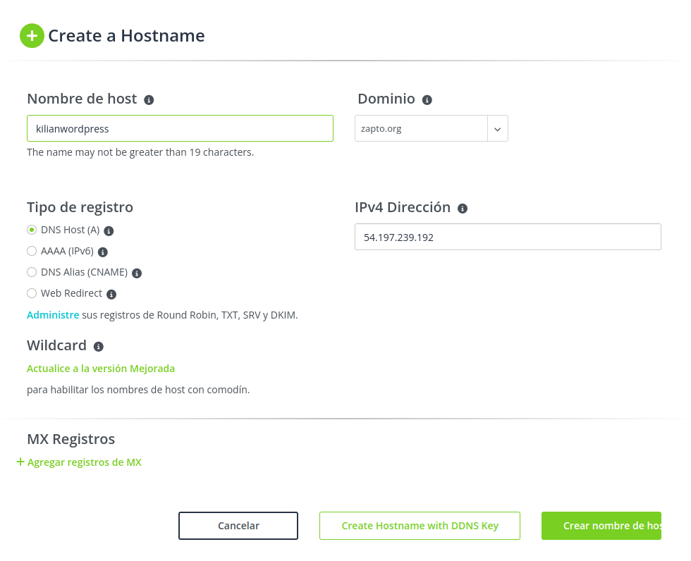
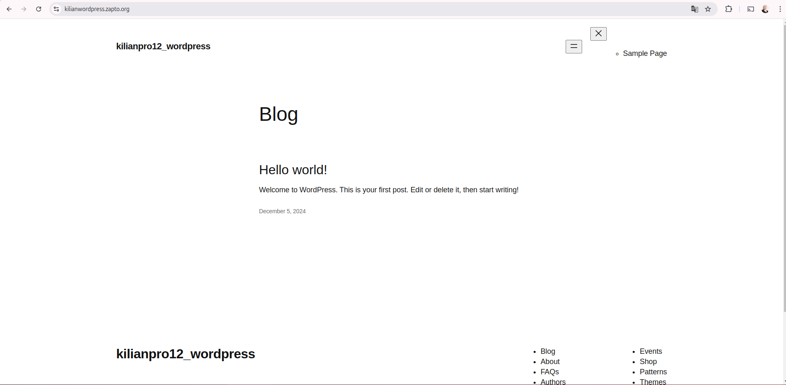
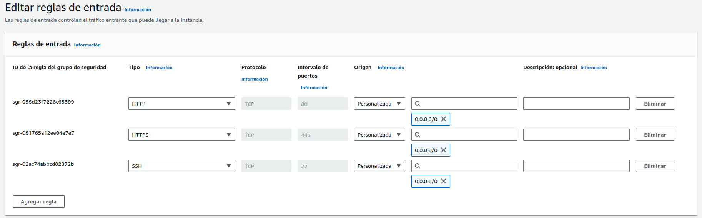
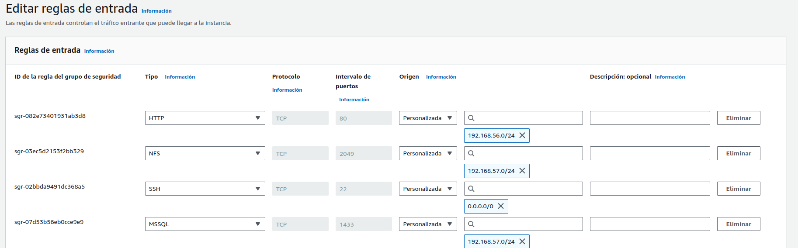
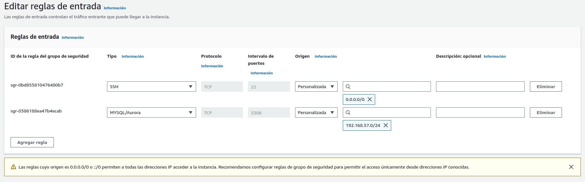

# Implementación de un CMS WordPress en Alta Disponibilidad y Escalabilidad en AWS

## Índice
1. [Introducción](#introducción)


---

## 1. Introducción
---
La clase de ASIR 2º nos han mandado hacer un CMS WordPress en Alta Disponibilidad en AWS con:

Capa 1: Capa pública. Balanceador de carga.
Capa 2: Capa privada. Servidores de Backend + NFS.
Capa 3: Capa privada. Servidor de BBDD.

Este es el manual que he preparado para poder ayudar a la gente explicando paso a paso.

## 2. Creacion de la VPC y las subredes
---
Necesitamos 2 subredes privadas y una pública.

<br>


<br>


Se crean 3 tablas dee enrutamineto, pero solo necesitaremos 2, una para la pública y otra para la privada, pero eso lo veremos más adelante.
Cada subred con su rango de ips.

<br>


<br>

## 3. Creacion de las instancias
---
Ahora nos vamos a la seccion de EC2 para empezar a crear las intancias de cada subred

<br>


<br>

Tenemos que crear un par de claves para poder accceder mediante ssh.
Selecionamos la VPC que hemos creado y la subred a la que va a pertenecer la intancia.

<br>


<br>

Los grupos de seguridad vamos a permitir todo para poder intalar todo correctamente y luego lo cambiaremos para tener mayor seguridad.

<br>


<br>

La creamos al igual que todas las demas.

<br>


<br>

## 4. Creacion de la ip elastica y gateway NAT
---
Creamos una ip elastica y se la asignamos al balanceador.

<br>


<br>

Creamos una gateway NAT, la vinculamos a subred publica para que las redes privadas tengan acceso a intenet para descargar lo necesario.

<br>


<br>

## 5. Tablas de enrutamiento
---
Configuramos la tabla de enrutamineto de las redes publicas

<br>


<br>

Y ahora la tabla de enrutamineto de las redes privadas añadiendo la NAT que hemos creado antes.

<br>


<br>

Así quedaria la el mapa de recursos de la VPC.

<br>


<br>

## 6. Conectarse con ssh
---
Ahora nos vamos a conectar con ssh cogiendo la clave ssh que hemos descargado antes y apuntado a la ip pública del balanceador.

```bash
ssh -i "ssh-wordpress.pem" ubuntu@ec2-54-197-239-192.compute-1.amazonaws.com
```

Y con el `scp` copiaremos la clave ssh para pasarselo al balanceador y desde allí nos podremos conectar a las demás instancias.

```bash
scp -i ssh-wordpress.pem ssh-wordpress.pem ubuntu@ec2-54-197-239-192.compute-1.amazonaws.com:/home/ubuntu
```

Dentro de cada máquina comprovaremos si tienen conexióna internet y se hacen `ping` entre ellas.

Una vez que lo comprovemos pasaremos todos los scripts de aprovisionamiento de las intancias a cada una la suya.

<br>


<br>

## 7. Crear dominio
---
Antes de ejecutar los scripts nos iremos a una página que nos de un dominio gratis como  y creamos un dominio y le asignamos la ip elástica del balanceador.

<br>



<br>

## 8. Ejecutar los scripts
---
Ejecutaremos los scripts con `sudo sh`.
Y una vez terminen todas las intancias de ejecutar los scripts, nos vamos al navegador y ponemos el nombre del dominio. 

<br>


<br>

## 8. Página Wordpress
---
Una vez terminemos con todos los pasos accederemos a nuestro blog de wordpress.

<br>



<br>

## 9. Cambiar las reglas de seguridad
---
Una vez esté instalado todo tenemos que cambiar las reglas de seguridad evitar problemas.
Esta es las reglas del Balanceador.

<br>



<br>

Esta es las reglas de los Backends + NFS

<br>



<br>

Esta es las reglas de la Bade de Datos.

<br>



<br>

Una vez cambiadas las reglas comprovamos que la página wordpress esté operativa sin fallos y significará que lo hemos hecho todo bien. :)


