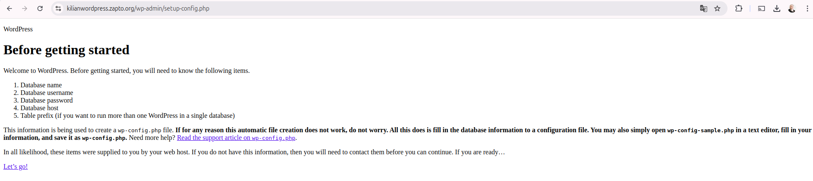

# Implementación de un CMS WordPress en Alta Disponibilidad y Escalabilidad en AWS

## Índice
1. [Introducción](#1-introducción)
2. [Creación de la VPC y las subredes](#2-creación-de-la-vpc-y-las-subredes)
3. [Creación de las instancias](#3-creación-de-las-instancias)
4. [Creación de la IP elástica y gateway NAT](#4-creación-de-la-ip-elástica-y-gateway-nat)
5. [Tablas de enrutamiento](#5-tablas-de-enrutamiento)
6. [Conectarse con SSH](#6-conectarse-con-ssh)
7. [Crear dominio](#7-crear-dominio)
8. [Ejecutar los scripts](#8-ejecutar-los-scripts)
9. [Página WordPress](#9-página-wordpress)
10. [Cambiar las reglas de seguridad](#10-cambiar-las-reglas-de-seguridad)
11. [Autores](#11-autores)
---

## 1. Introducción
---
La clase de ASIR 2º nos ha mandado hacer un CMS WordPress en Alta Disponibilidad en AWS con:

- **Capa 1:** Capa pública. Balanceador de carga.  
- **Capa 2:** Capa privada. Servidores de Backend + NFS.  
- **Capa 3:** Capa privada. Servidor de BBDD.  

Este es el manual que he preparado para poder ayudar a la gente explicando paso a paso.

## 2. Creación de la VPC y las subredes
---
Necesitamos 2 subredes privadas y una pública.

<br>


<br>

Se crean 3 tablas de enrutamiento, pero solo necesitaremos 2: una para la pública y otra para la privada (esto lo veremos más adelante).  
Cada subred tendrá su rango de IPs.

<br>


## 3. Creación de las instancias
---
Ahora nos vamos a la sección de EC2 para empezar a crear las instancias en cada subred.

<br>


<br>

Tenemos que crear un par de claves para poder acceder mediante SSH.  
Seleccionamos la VPC que hemos creado y la subred a la que va a pertenecer la instancia.

<br>


<br>

Los grupos de seguridad inicialmente permitirán todo para poder instalar correctamente, y luego los ajustaremos para mayor seguridad.

<br>


<br>

Creamos las instancias siguiendo este proceso.

<br>


## 4. Creación de la IP elástica y Gateway NAT
---
Creamos una IP elástica y la asignamos al balanceador.

<br>


<br>

Creamos un Gateway NAT, vinculándolo a la subred pública para que las redes privadas tengan acceso a Internet y puedan descargar lo necesario.

<br>


## 5. Tablas de enrutamiento
---
Configuramos la tabla de enrutamiento de las redes públicas.

<br>


<br>

Luego, configuramos la tabla de enrutamiento de las redes privadas añadiendo la NAT creada anteriormente.

<br>


<br>

Así quedaría el mapa de recursos de la VPC.

<br>


## 6. Conectarse con SSH
---
Ahora nos conectaremos con SSH utilizando la clave que hemos descargado previamente, apuntando a la IP pública del balanceador.

```bash
ssh -i "ssh-wordpress.pem" ubuntu@ec2-54-197-239-192.compute-1.amazonaws.com
```

Y con el `scp` copiaremos la clave ssh para pasarselo al balanceador y desde allí nos podremos conectar a las demás instancias.

```bash
scp -i ssh-wordpress.pem ssh-wordpress.pem ubuntu@ec2-54-197-239-192.compute-1.amazonaws.com:/home/ubuntu
```

Dentro de cada máquina comprobaremos si tienen conexión a internet y se hacen `ping` entre ellas.

Una vez que lo comprobemos, pasaremos todos los scripts de aprovisionamiento de las instancias a cada una la suya.

<br>


## 7. Crear dominio
---
Antes de ejecutar los scripts, nos iremos a una página que nos dé un dominio gratis como [MY NO-IP](https://www.noip.com/) y creamos un dominio, asignándole la IP elástica del balanceador.

<br>


## 8. Ejecutar los scripts
---
Ejecutaremos los scripts con `sudo sh`.  
Y una vez terminen todas las instancias de ejecutar los scripts, nos vamos al navegador y ponemos el nombre del dominio.

<br>



## 9. Página WordPress
---
Una vez terminemos con todos los pasos, accederemos a nuestro blog de WordPress.

<br>


## 10. Cambiar las reglas de seguridad
---
Una vez esté todo instalado, tenemos que cambiar las reglas de seguridad para evitar problemas.  
Estas son las reglas del Balanceador:

<br>


<br>

Estas son las reglas de los Backends + NFS:

<br>


<br>

Estas son las reglas de la Base de Datos:

<br>


<br>

Una vez cambiadas las reglas, comprobamos que la página de WordPress esté operativa sin fallos, lo que significará que hemos hecho todo correctamente. :)

## Autores
---
- **Kilian Gimenez** - [GitHub](https://github.com/Kilian-max) - Creador y jefe del proyecto.


